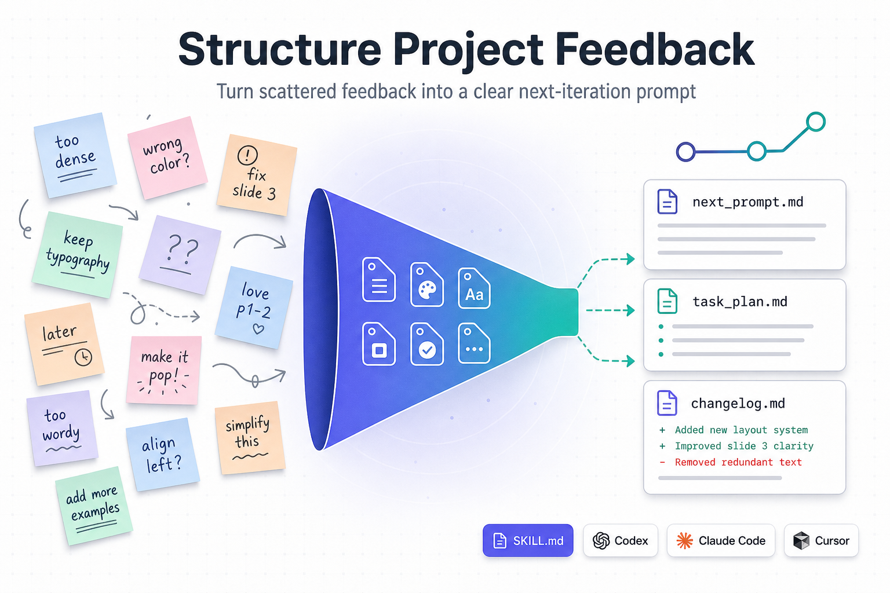

# Structure Project Feedback

[English](README.md) | **简体中文**

<p align="center">
  
</p>

> 把项目迭代后那一堆零散的人类反馈，整理成一份清晰的下一轮 prompt、一份更新过的文件式计划，以及一次可以 review 的 Git diff。

[](LICENSE)
[](structure-project-feedback/SKILL.md)
[](https://github.com/openai/codex)
[](https://docs.anthropic.com/claude-code)
[](https://cursor.sh)

每次给到用户一个迭代结果之后(无论是写作初稿、原型、PPT、代码改动还是研究材料)，用户给回来的反馈往往是 **混乱、半成型** 的：纠错、口味偏好、模糊的意图、硬性约束、跑题的待办点子全都混在一起。多数 AI 智能体面对这种输入时，会含糊地"我再试试"——结果原始措辞丢了、审计链断了、上一轮决策也被悄悄覆盖。

`structure-project-feedback` 是一个 AI 智能体 **skill**（遵循 `SKILL.md` 规范），它给任何兼容的智能体一个固定动作：

0. **自举（Bootstrap）**：*仅首次使用时* —— 先读懂项目当前结构并沿用它的命名风格，而不是硬塞一套标准文件到你的仓库上。
1. **保留**：先把用户的原话存好，再去归纳。
2. **分类**：区分必须立刻改 vs 应保持稳定。
3. **生成**：产出一份下一轮 prompt，可审计、跨工具复用。
4. **更新**：同步文件式的计划记录（`task_plan.md`、`findings.md`、`progress.md`、`changelog.md`）。
5. **复审**：用 Git 让人类清楚看到这一轮到底改了什么。

这个 skill 兼容任何遵循 SKILL.md / AGENTS.md 约定的 AI 智能体：**Codex CLI、Claude Code、Cursor、Gemini CLI** 等。

---

## 为什么要用这个 skill

| 痛点 | 没装 skill 时 | 装了 skill 之后 |
|---|---|---|
| 半成型反馈（"语气不太对，再加个 X 试试？"） | 智能体会整体重写，原话丢失 | 原话先归档；按类别整理；只改用户真正要求改的那部分 |
| 多轮反馈循环 | 计划漂移，旧决策被遗忘 | `findings.md` + `changelog.md` 把决策固化下来 |
| 在多个 AI 工具间切换 | 每个工具都要重新理解上下文 | 生成的 next-iteration prompt 工具无关、可复用 |
| 一轮迭代后"到底改了啥？" | 散乱的 diff 难以 review | Git diff + 一套文件 kit 让每一处改动可见 |
| 把 skill 引入一个已经有自己 `TODO.md` / `ROADMAP.md` / `DECISIONS.md` 的仓库 | 智能体又新建一套计划文件，出现两套"真相"相互漂移 | **Bootstrap 步骤** 先把已有文件映射到 skill 的角色，原地复用 |

---

## 快速安装

### Codex CLI

```bash
mkdir -p ~/.codex/skills
cd ~/.codex/skills
git clone https://github.com/jiangjin1999/structure-project-feedback-skill.git _spf
mv _spf/structure-project-feedback ./
rm -rf _spf
```

然后在对话中触发：

```text
用 $structure-project-feedback 把我这堆散乱的项目反馈整理成
下一轮 prompt，并更新计划文件。
```

### Claude Code

```bash
mkdir -p ~/.claude/skills
cd ~/.claude/skills
git clone https://github.com/jiangjin1999/structure-project-feedback-skill.git _spf
mv _spf/structure-project-feedback ./
rm -rf _spf
```

如果想做项目级安装，把目标路径换成项目里的 `.claude/skills/`。

### Cursor

全局安装：

```bash
mkdir -p ~/.cursor/skills
cd ~/.cursor/skills
git clone https://github.com/jiangjin1999/structure-project-feedback-skill.git _spf
mv _spf/structure-project-feedback ./
rm -rf _spf
```

项目级安装：把 `structure-project-feedback/` 目录直接放到项目根目录下的 `.cursor/skills/`。

### Gemini CLI / OpenClaw / 其他通用 SKILL.md 工具

把 `structure-project-feedback/` 目录放到该智能体读取 skill 清单的位置即可。这个 skill 是纯 markdown，无运行时、无 MCP server、无外部 API 调用。

### 在 `AGENTS.md` 里加触发规则

```md
## Skills

- structure-project-feedback：当用户对一个草稿、原型、代码结果、文档、PPT
  或计划给出多个零散评论时使用。产出下一轮 prompt 并更新计划文件
  （`task_plan.md`、`findings.md`、`progress.md`、`changelog.md`）。
```

---

## 什么时候应该用

- 用户已经看到结果，给出 **混合型反馈**（纠错 + 新点子 + 风格 + 问题混在一起）。
- **多轮项目循环** 中，希望下一轮 prompt 可以跨 AI 工具复用。
- 你维护着 `task_plan.md`、`findings.md`、`progress.md` 这类记录，希望它们被一致地更新。
- 你需要 **审计链**（Git diff）来证明每一轮反馈到底改了哪些东西。

## 什么时候不要用

- 单一、原子、毫无歧义的指令（比如"把 `foo` 改名成 `bar`"）。直接改即可。
- 全新项目，还没有任何前置成果。先用 planning / brainstorming 类 skill。
- 纯代码重构，没有任何人类语言反馈。走你平常的 code-edit 流程。

---

## Bootstrap：从已有项目自举

当 skill **首次** 在一个已经有内容的项目上运行时（有代码、有文档、有自己的 `TODO.md`、有 `AGENTS.md`、有 `ROADMAP.md`、有 `docs/decisions/` 目录等等），它**不会**用一套标准文件覆盖你的既有结构，而是去适配：

1. **扫描** 顶层目录树；读 `README`、`AGENTS.md`、`CONTRIBUTING.md`，以及最近 10 条 commit（只读）。
2. **映射** 已有文件到 skill 的角色。例如：

   | skill 的角色 | 可接受的已有文件 |
   |---|---|
   | `feedback.md` | `notes.md`、`REVIEW.md`、`comments.md`、`issues/*.md`、…… |
   | `task_plan.md` | `TODO.md`、`PLAN.md`、`ROADMAP.md`、`backlog.md`、`tasks.md`、…… |
   | `findings.md` | `DECISIONS.md`、`docs/decisions/`、`ADR/`、`rationale.md`、…… |
   | `progress.md` | `PROGRESS.md`、`status.md`、`weekly.md`、`journal.md`、…… |
   | `changelog.md` | `CHANGELOG.md`、`HISTORY.md`、`RELEASE_NOTES.md`、…… |
   | `next_prompt.md` | `prompt.md`、`next.md`、`instructions.md`、…… |

3. **推断项目类型**（library / 论文 / PPT / web app / 研究 notebook / 纯文档等），从证据出发（`pyproject.toml`、`*.tex`、`*.key`、`package.json`、`notebooks/` 等）。
4. **只补缺失的部分**，并沿用仓库已有的命名风格（`UPPERCASE.md` vs. `lowercase.md` vs. `kebab-case.md`）。
5. **把映射结果记下来**，写到 `findings.md`（或其映射等价物）中的 `## Project shape — auto-detected (<日期>)` 一节。这个块同时是幂等标记 —— bootstrap **每个项目只跑一次**。

如果有模糊点（比如存在两个都像 `task_plan` 的候选），skill 会**合并成一个问题**一次问清，不会甩一连串小问题给你。如果仓库结构大改过，你可以直接说 *"重新做一次 project shape 的 bootstrap"*，skill 就会重跑。

---

## skill 会产出什么

每一轮反馈跑完之后，会得到一组稳定的产物：

```text
your-project/
├── feedback.md            ← 原始反馈，按原话保留
├── archive/
│   └── feedback-2025-04-12.md   ← 历史原始反馈
├── task_plan.md           ← 任务清单及状态
├── findings.md            ← 决策、约束、经验教训
├── progress.md            ← 本轮改了什么、还剩什么
├── next_prompt.md         ← 下一轮可直接复用的 prompt
└── changelog.md           ← 人类可读的变更历史
```

加上一份你 commit 之前就能 review 的 Git diff。

---

## 一个完整示例

**输入 —— 用户看完一份 PPT 草稿后丢回来 6 条 bullet：**

> "前两页感觉对的；第 3 页太挤了；可以试个不一样的配色吗；第 4 页我们到底想说什么来着？字体不要动；案例研究那块这一轮先放着。"

**skill 产出：**

`feedback.md` 完整保留这 6 条原话。

`next_prompt.md`：

```markdown
# 下一轮 Prompt

## 必须立刻改
- 降低第 3 页的信息密度（≤ 4 条 bullet，每条 ≤ 25 字）。
- 尝试新的配色方案（先给出 2–3 个候选再实施）。

## 保持稳定
- 第 1–2 页（已认可）。
- 现有字体方案。

## 待澄清的问题
- 第 4 页的核心信息是什么 —— 改版前需要先确认。

## 待办池
- 案例研究章节。

## 验收标准
- 第 3 页字数 ≤ 100。
- 配色方案 A/B 各保存为一个独立文件。
```

`task_plan.md`、`progress.md`、`changelog.md` 也会被增量更新。任何会被覆盖的稳定文件，会先在 `archive/` 里留一份快照。

同样的循环对**代码 PR review、论文导师批注、设计稿评审、产品 demo 反馈** 都适用。

### 完整 walkthrough —— 跨 3 轮迭代的连贯故事

三个示例围绕真实开源项目 [`openai/codex`](https://github.com/openai/codex)
（OpenAI 开源的 ~80k★ 命令行 coding agent）正在设计的一个真实功能 ——
**跨 session 的持久化 agent memory** —— 展示 `task_plan.md`、`findings.md`、
`progress.md`、`changelog.md` 如何作为项目的长期文件式 memory 累积起来。

| # | 迭代 | 看点 |
|---|---|---|
| 1 | [RFC triage（12 条 GitHub Discussion 评论）](examples/zh-CN/iteration-1-rfc-triage.md) | 从零创建 file kit；登记 4 项未决决策 |
| 2 | [PR review（含对前一轮决策的挑战）](examples/zh-CN/iteration-2-pr-review.md) | 先读 `findings.md`；**重新打开** Q1 而不是悄悄翻转它 |
| 3 | [上线后用户反馈（含 deferred idea 复活）](examples/zh-CN/iteration-3-post-launch-feedback.md) | 识别已 defer 的点子；执行 1 个月前设的约束，无需任何人类重述 |

索引见 [examples/zh-CN/README.md](examples/zh-CN/README.md)。

---

## 内部工作流

skill 遵循 [`structure-project-feedback/SKILL.md`](structure-project-feedback/SKILL.md) 中详述的流程：

0. **Bootstrap**（每个项目首次） —— 扫描项目、把已有文件映射到 skill 角色、把映射记到 `## Project shape — auto-detected` 一节。
1. **定位** —— 先读现有指令和计划（用上面那张映射表）。
2. **保留** —— 在归纳之前先归档原始反馈。
3. **分类** —— Must change / Keep stable / Intent / Evidence / Constraint / Question / Backlog。
4. **转换** —— 产出带验收标准的下一轮 prompt。
5. **更新** —— 同步计划文件。
6. **执行**（可选） —— 仅当用户明确要求时才动手实施。
7. **复审** —— `git status`、`git diff`、staging、按需 commit。

可复用的 prompt 骨架在 [`structure-project-feedback/references/feedback-prompt-template.md`](structure-project-feedback/references/feedback-prompt-template.md)。

---

## 兼容性

| 智能体 | 是否支持 | 默认安装路径 |
|---|---|---|
| Codex CLI | ✅ | `~/.codex/skills/` |
| Claude Code | ✅ | `~/.claude/skills/`（或项目级 `.claude/skills/`） |
| Cursor | ✅ | `~/.cursor/skills/`（或项目级 `.cursor/skills/`） |
| Gemini CLI | ✅ | 按 SKILL.md 约定 |
| OpenClaw / Trae / 其他通用 SKILL.md 工具 | ✅ | 按各自 skill loader 规范 |

skill 本身只是 markdown，不依赖任何运行时、MCP server 或外部 API。

---

## 仓库结构

```text
structure-project-feedback-skill/
├── README.md
├── README.zh-CN.md
├── LICENSE
├── docs/
│   └── cover.png
├── examples/
│   ├── README.md
│   ├── iteration-1-rfc-triage.md
│   ├── iteration-2-pr-review.md
│   ├── iteration-3-post-launch-feedback.md
│   └── zh-CN/
│       ├── README.md
│       ├── iteration-1-rfc-triage.md
│       ├── iteration-2-pr-review.md
│       └── iteration-3-post-launch-feedback.md
└── structure-project-feedback/
    ├── SKILL.md
    ├── agents/
    │   └── openai.yaml
    └── references/
        └── feedback-prompt-template.md
```

---

## 常见问题

**仓库不是 Git 仓库还能用吗？**
能。Git review 这一步是软性建议，没有 `git` 时 skill 仍然会产出结构化 prompt 和文件更新。

**我的项目没用 `task_plan.md` 这套命名怎么办？**
skill 会优先沿用你仓库里已有的文件名。如果完全没有，它只会创建最小够用的子集。

**会覆盖我已有的计划文件吗？**
不会。它是增量更新；任何大幅缩减都会先把原文件快照到 `archive/`。

**非英语项目能用吗？**
能。skill 明确要求智能体保持用户语言，除非用户主动要求换语言。

**它和通用的"planning skill"有什么不同？**
planning skill 帮你在 **第一次迭代之前** 拆解工作；这个 skill 专门处理 **结果出来之后、人类给回反馈** 的那个时刻。两者可以叠加使用。

**我仓库里已经有自己的 `TODO.md` / `DECISIONS.md` / `CHANGELOG.md`，这个 skill 会不会复制一份新的？**
不会。**Bootstrap** 步骤（Step 0）会检测已有文件并原地复用 —— 只在角色真正缺失时才新建，且沿用你仓库既有的命名风格（`UPPERCASE.md`、`lowercase.md`、`kebab-case.md`）。

**如果 bootstrap 映射错了怎么办？**
映射结果会写到 `findings.md`（或其映射等价物）的 `## Project shape — auto-detected` 一节。你改一下再跟智能体说"重新做一次 project shape 的 bootstrap"，下一轮它就会重读那个块。

---

## 参与贡献

欢迎提 issue、建议和 PR，特别欢迎以下方向：

- 新的 `AGENTS.md` 触发短语（中英文都欢迎）。
- 更多语言、更多领域的实战示例。
- 对 next-iteration prompt 模板的优化。

请保持示例的通用性，避免使用具体项目的内部信息，方便 skill 跨领域复用。

---

## 许可证

[MIT](LICENSE) —— 自由使用、修改和再分发。

---

如果这个 skill 帮到了你，欢迎给仓库点个 star，并分享给同样在做"多轮 AI 迭代循环"的朋友。
